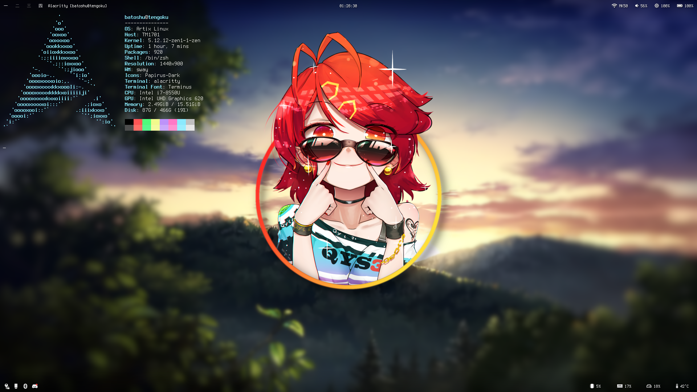

# Batoshu's dotfiles


# Dependencies
Here's list of packages used in my setup.
### Essential packages
```bash
zsh 
zsh-completions

sway
swaybg
swayidle
swaylock-effects-git # AUR

waybar
dex
polkit
polkit-gnome
kanshi

light
slurp
grim
wl-clipboard

alacritty
nwg-launchers-git # AUR

yay # AUR
```

### Other applications
```bash
keepassxc
firefox
minidlna
transmission-cli
transmission-remote-gtk
vim
htop
neofetch
```

### Fonts & icons 
Only few selected
```bash
ttf-dejavu
ttf-hack
noto-fonts
noto-fonts-cjk
noto-fonts-emoji
terminus-font
otf-font-awesome

papirus-icon-theme
```

### Kernel
`linux-zen`

# Wallpaper
[Source](https://www.deviantart.com/bisbiswas/art/Storm-On-The-Way-871209944)
